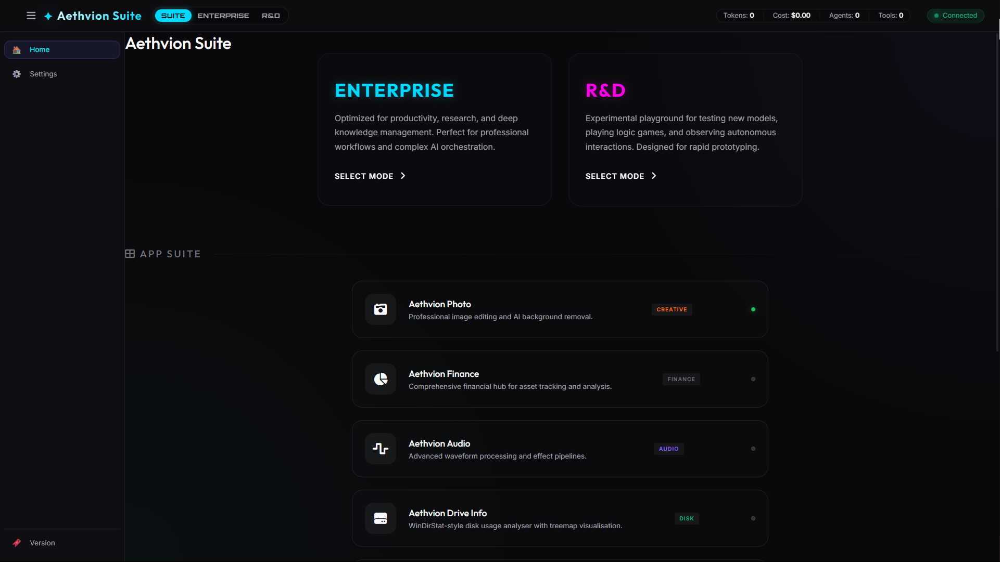
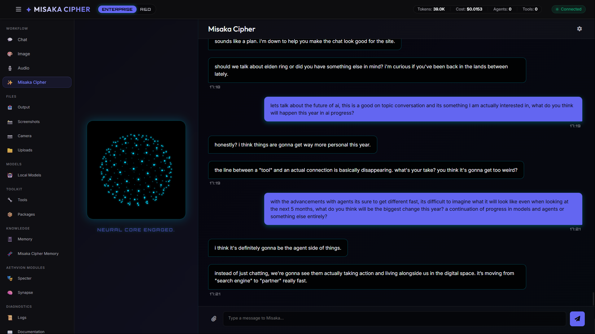
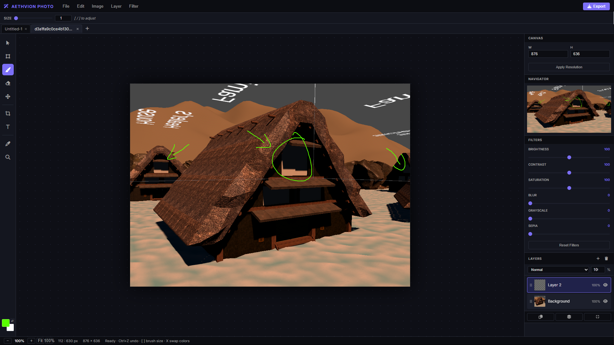
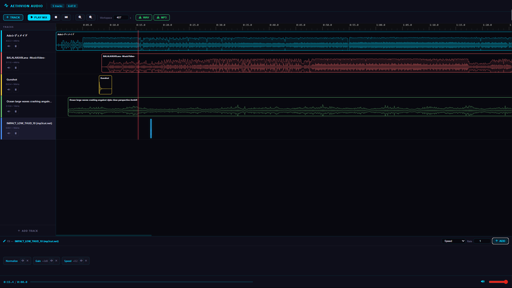
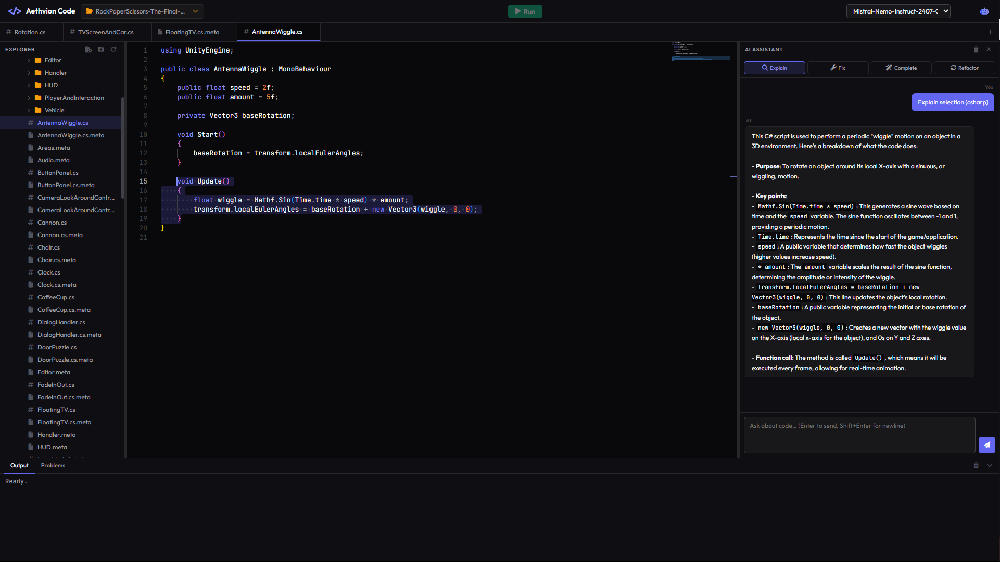
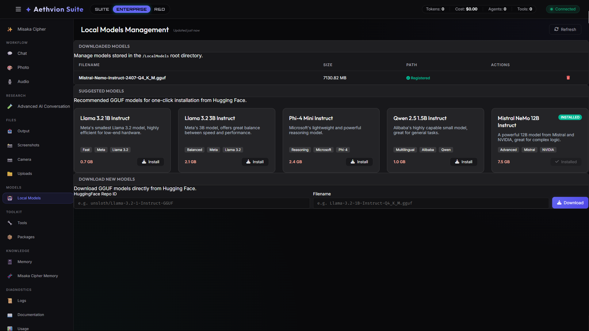
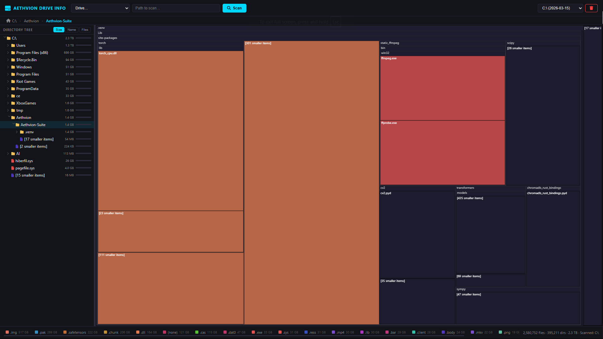
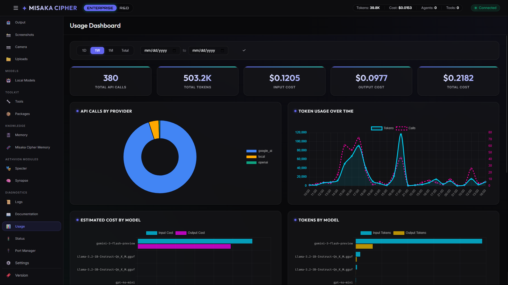

<div align="center">

# Aethvion Suite

**A self-hosted AI platform — chat, agents, tools, and apps, all running locally**

[](https://www.python.org/downloads/)
[](LICENSE)
[](https://github.com/Aethvion/Aethvion-Suite)
[](CONTRIBUTING.md)

[📚 Documentation](/core/documentation/) · [🚀 Getting Started](/core/documentation/human/getting-started.md) · [💬 Discussions](https://github.com/Aethvion/Aethvion-Suite/discussions)


*Connect cloud providers or run local GGUF models. Control everything from a 25+ tab dashboard, an AI-powered code IDE, or a terminal CLI — your platform, your rules.*

⚠️ **EXPERIMENTAL — EARLY DEVELOPMENT** · Actively being built. Expect rough edges and partially-implemented features.

</div>

---

## 🖼️ Showcase

<div align="center">



</div>

<br>

<div align="center">

| | |
|:---:|:---:|
|  |  |
| **Misaka Cipher** · Multi-provider AI chat with threads, auto-routing, and context modes | **Aethvion Photo** · AI image generation and precision layer-based editing system |
|  |  |
| **Aethvion Audio** · Professional multi-track timeline editor with live waveforms and effects | **Aethvion Code IDE** · Monaco-based IDE with AI copilot and code execution |
|  |  |
| **Direct Local Inference** · Run GGUF models (Mistral, LLaMA) directly on your hardware | **Aethvion Drive Info** · Recursive system storage analysis and visualization |

<br>



**Usage & Cost Tracking** · Token usage, cost estimates, and granular per-query breakdowns

</div>

---

## 🎯 What Is Aethvion Suite?

Aethvion Suite is a **self-hosted AI assistant platform** that connects to cloud providers (Google Gemini, OpenAI, xAI Grok, Anthropic Claude) and local GGUF models via llama-cpp-python. It gives you a structured environment for running chat threads, generating tools, spawning agents, and interacting with a growing set of integrated apps — all from a server you own and control.

There are **two main components** to the ecosystem:

### 1. Aethvion Suite Core
The central intelligence hub and management platform. It provides the dashboard, API orchestration, and foundational AI services.

| Interface | Description |
|-----------|-------------|
| **Web Dashboard** | 25+ tab control center — chat, agents, tools, memory, games |
| **Core Terminal** | CLI mode for headless use, scripting, and developer queries |

### 2. Standalone Integrated Applications
Professional-grade tools built on the Aethvion core. Each app runs as a standalone server but integrates seamlessly into the main dashboard.

| App | Role | Default Port |
|-----|------|--------------|
| **Aethvion Code IDE** | VS Code-powered IDE with AI chat and execution | 8083 |
| **Aethvion VTuber** | 2D character rigging and animation engine | 8081 |
| **Aethvion Audio** | Multi-track timeline editor and effects processor | 8081* |
| **Aethvion Photo** | Layer-based image generation and editor | 8081* |
| **Aethvion Tracking** | AI-powered facial motion capture bridge | 8081* |
| **Aethvion Drive Info** | Interactive disk space and storage analyzer | 8084 |
| **Aethvion Finance** | Personal financial tracking and portfolio hub | 8081* |

*\* Note: Apps sharing port 8081 will automatically negotiate the next available port (8082, etc.) if multiple are running simultaneously.*

The AI core features **Misaka Cipher**, backed by four subsystems:

| Component | Role | Status |
|-----------|------|--------|
| **Nexus Core** | Single entry point — routes all requests, manages trace IDs | ✅ Stable |
| **The Factory** | Spawns transient worker agents for complex tasks | 🧪 Works for basic tasks |
| **The Forge** | Generates Python tools autonomously | 🧪 Works for simple tools |
| **Memory Tier** | ChromaDB episodic memory + knowledge graph | ✅ Storage stable, retrieval improving |

**Cloud Providers:** Google AI (Gemini) · OpenAI (GPT-4o) · xAI (Grok) · Anthropic (Claude)
**Local Models:** GGUF via llama-cpp-python (Mistral, LLaMA, Phi, and others)
**Intelligence Firewall:** PII/credential scanning before any external API call — blocks sensitive data from leaving.

---

## 🚀 Quick Start

```bash
# Clone and install
git clone https://github.com/Aethvion/Aethvion-Suite.git
cd Aethvion-Suite
pip install -e ".[memory]"

# Configure providers
copy .env.example .env
# Edit .env — add any of: GOOGLE_AI_API_KEY / OPENAI_API_KEY / GROK_API_KEY / ANTHROPIC_API_KEY
# Leave them blank to use only local models
```

**One-click (Windows):** Double-click a launcher bat — it creates the virtual environment, installs dependencies, and opens the app automatically.

**One-click (Windows):** Each application includes a dedicated launcher script. Double-click the `.bat` file to automatically check dependencies and start the server.

| Application | Launcher | Default URL |
|-------------|----------|-------------|
| **Suite Dashboard** | `Start_Aethvion_Suite.bat` | http://localhost:8080 |
| **Code IDE** | `apps/code/Start_Code.bat` | http://localhost:8083 |
| **VTuber Engine** | `apps/vtuber/Start_VTuber.bat` | http://localhost:8081 |
| **Audio Editor** | `apps/audio/Start_Audio.bat` | http://localhost:8081* |
| **Photo Editor** | `apps/photo/Start_Photo.bat` | http://localhost:8081* |
| **Finance Hub** | `apps/finance/Start_Finance.bat` | http://localhost:8081* |
| **Drive Info** | `apps/driveinfo/Start_DriveInfo.bat` | http://localhost:8084 |
| **Tracking Bridge**| `apps/tracking/Start_Tracking.bat` | http://localhost:8081* |

**Manual:**
```bash
python -m core.main           # web dashboard
python -m core.main --cli     # interactive CLI
python -m core.main --test    # run verification tests
python apps/code/code_server.py    # Code IDE standalone
```

---

## ✅ What Works Right Now

### 💬 Chat & Threads
- Multi-provider chat (Google, OpenAI, Grok, Anthropic) with automatic failover
- Local GGUF model inference via llama-cpp-python — no cloud required
- Persistent conversation threads with configurable context modes (none / smart / full)
- Per-message model selection or **auto-routing** (LLM picks the best model from your enabled pool)
- Collapsible, flush-edge chat UI with persistent layout state memory

### 🤖 Agent Mode
- Basic agent spawning for analysis and execution tasks
- Intent detection routes messages to chat or agent execution
- Step-by-step execution visible in the System Terminal panel

### ⚒️ Tool Forge
- AI can generate Python tools and register them for reuse
- Generated tools are saved locally and available in subsequent sessions

### 🧠 Memory
- Episodic memory stored in ChromaDB (vector search)
- Every conversation stored as a task JSON with model, routing, and usage metadata

### 💻 Code IDE
- Full Monaco editor (VS Code engine) with syntax highlighting for 30+ languages
- AI copilot: chat, explain, fix, complete, refactor — all with streaming responses
- **File creation from chat** — the AI uses `### FILE:` markers; files are written to disk automatically
- Code execution: Python, Node.js, Bash/Shell — output streams to the built-in terminal
- Persistent workspace state — remembers open tabs, last workspace, and recent projects per folder
- Project context injection — the AI receives your workspace file structure on every request
- Native OS folder picker for workspace selection
- Resizable 3-panel layout: file tree · Monaco editor · AI chat

### 🎙️ Audio Interaction (Core)
- Built-in Text-to-speech (TTS) and speech-to-text (STT) support within the dashboard and chat.
- Configurable voice profiles and audio processing settings.

### 🎵 Aethvion Audio (Standalone)
- Full multi-track timeline editor with per-track volume, solo, and pan.
- Professional waveform visualization with gradient rendering and real-time effects.
- Format conversion and effects pipeline (Normalization, Gain, Pitch, Speed).

### 🎮 Games
- Built-in games: Logic Quest, Blackjack, Sudoku, Word Search, Checkers (vs AI)
- Leaderboard to track scores across sessions

### 🎭 VTuber & 📊 Tracking
- **Aethvion VTuber:** Visualization and animation engine — rigging, real-time deformation, preview/live modes
- **Aethvion Tracking:** Motion tracking via WebSocket at port 8082, streams parameters directly to the VTuber viewer
- Live mode auto-discovers the tracking server; browser connects directly with auto-reconnect

### 🔌 Nexus Module
- Peripheral plugin hub — screen capture, webcam, Spotify, weather, system info
- Registry-driven architecture for adding new integrations

### 📊 Dashboard Tabs (25+)

| Tab | Status | Notes |
|-----|--------|-------|
| Chat | ✅ Working | Threads, context, model selection, auto-routing |
| Image | ✅ Working | Imagen 3 / DALL-E 3 image generation |
| Audio | ✅ Working | Text-to-speech and speech-to-text |
| Arena | ✅ Working | Side-by-side model comparison |
| AI Conversations | ✅ Working | Two-party model conversation |
| Advanced AI Conversation | ✅ Working | Multi-persona conversation threads |
| Leaderboards | ✅ Working | Game scores and rankings |
| Logic Quest | 🎮 Game | AI-powered logic puzzles |
| Blackjack | 🎮 Game | Classic card game |
| Sudoku | 🎮 Game | Sudoku puzzles |
| Word Search | 🎮 Game | Word search puzzles |
| Checkers (vs AI) | 🎮 Game | Checkers against an AI opponent |
| Misaka Cipher | ✅ Working | Main hub: output files, screenshots, camera, uploads |
| Tools | ✅ Working | View registered tools and agents |
| Packages | 🧪 Experimental | Package install with safety scoring — unstable |
| Memory | ✅ Working | Browse task history and episodic memory |
| Misaka Memory | ✅ Working | Dedicated episodic memory browser |
| Aethvion VTuber | ✅ Working | Character animation and visualization engine |
| Aethvion Tracking | ✅ Working | Motion tracking module |
| Aethvion Code | ✅ Working | AI-powered IDE (standalone app, port 8083) |
| Logs | ✅ Working | Live log stream |
| Documentation | ✅ Working | In-dashboard documentation viewer |
| Usage | ✅ Working | Token usage, cost tracking, and granular queries |
| Status | ✅ Working | System and provider health |
| Port Manager | ✅ Working | View and manage active service ports |
| Settings | ✅ Working | Providers, routing profiles, Discord, assistant, environment config |

---

## ⚠️ Known Limitations

- **Autonomous long-running tasks:** Agent execution works for single well-defined tasks, not multi-step plans over hours or days.
- **Memory integration:** Memory is stored reliably but not yet deeply wired into agent decision-making.
- **Tool forge reliability:** Simple tools generate fine; anything requiring external libraries or complex multi-file output can be unreliable.
- **Ollama / vLLM:** Not yet supported. Local inference uses llama-cpp-python (GGUF files) directly.
- **Production hardening:** This is a personal/research project, not audited or hardened for production deployments.

---

## 📁 Directory Structure

```
Aethvion-Suite/
├── Start_Aethvion_Suite.bat     # One-click install + launch (main dashboard)
├── pyproject.toml               # All dependencies + project metadata
│
├── core/                        # Shared AI core — used by all apps and the dashboard
│   ├── main.py                  # Entry point (web / CLI / test modes)
│   ├── nexus_core.py            # Central orchestration hub
│   ├── config/                  # Configuration files (YAML/JSON)
│   ├── factory/                 # Agent spawning engine
│   ├── forge/                   # Tool generation pipeline
│   ├── memory/                  # Episodic memory + knowledge graph (ChromaDB)
│   ├── nexus/                   # Nexus manager (peripheral plugin system)
│   ├── orchestrator/            # Master orchestrator + task queue
│   ├── providers/               # Google / OpenAI / Grok / Anthropic / Local adapters
│   ├── security/                # Intelligence Firewall
│   ├── utils/                   # Shared utilities (port manager, helpers)
│   ├── workers/                 # Background workers
│   ├── workspace/               # Usage tracker, package manager
│   └── interfaces/
│       ├── dashboard/           # Web dashboard (FastAPI + static files)
│       └── cli_modules/         # CLI module implementations
│
├── apps/                        # Standalone apps — each has its own server + launcher
│   ├── audio/                   # Audio processing (TTS / STT)
│   ├── code/                    # Code IDE — Monaco editor + AI copilot (port 8083)
│   │   ├── Start_Code.bat       # One-click launcher
│   │   ├── code_server.py       # FastAPI backend — FS, execution, AI endpoints
│   │   └── viewer/              # Frontend: Monaco editor, file tree, AI chat
│   ├── driveinfo/               # System storage and drive info
│   ├── finance/                 # Finance tracking
│   ├── photo/                   # AI-powered photo editing
│   ├── tracking/                # Motion tracking — WebSocket server (port 8082)
│   └── vtuber/                  # VTuber engine — character animation (port 8081)
│
├── data/                        # Runtime data — never committed
│   └── code/                    # Code IDE persistence
│       ├── settings.json        # Last workspace + recent workspaces
│       └── projects/            # Per-workspace state (open tabs, file structure, AI context)
│
├── LocalModels/                 # GGUF model files — place models here
├── tools/                       # Tool registry (standard + AI-generated)
├── tests/                       # Test suite
└── assets/                      # Static assets (character sprites, showcase images)
```

---

## 🗺️ Roadmap

### ✅ Done
- Multi-provider chat with failover and auto-routing
- Local GGUF model support via llama-cpp-python
- Persistent threads and task memory
- Tool forge and agent spawning
- Intelligence Firewall (PII/credential scan)
- Web dashboard with 25+ tabs
- API usage tracking with cost estimates
- LLM Arena, Image Studio, Advanced AI Conversation
- Routing profiles with configurable model pools
- Discord integration (bot worker, message mirroring, dashboard controls)
- Audio tab (TTS and STT)
- Games suite with leaderboards
- Aethvion VTuber and Tracking (WebSocket bridge, live mode)
- Nexus peripheral module
- Documentation viewer, Port Manager, and in-dashboard assistant
- **Code IDE** — Monaco editor, AI copilot, file creation, code execution, persistent workspace state

### 🔄 In Progress / Near-Term
- Improved agent reliability for multi-step goals
- Better memory integration in decision making
- Tool forge validation and reliability improvements
- Ollama integration for local model management UI
- Code IDE: diff view, multi-file refactor, git integration

### 🌟 Long-Term Vision
- Reliable autonomous multi-step goal execution
- Self-improving architecture (system modifies itself based on usage)
- True infinite sessions with human-in-the-loop checkpoints

---

## 🤝 Contributing

Contributions are welcome. See [CONTRIBUTING.md](CONTRIBUTING.md) for guidelines.

```bash
git clone https://github.com/Aethvion/Aethvion-Suite.git
cd Aethvion-Suite
pip install -e ".[memory]"
cp .env.example .env   # Windows: copy .env.example .env
```

---

## 📝 License

[MIT License](LICENSE)

---

## 🔗 Links

- **Docs:** [/core/documentation/](/core/documentation/)
- **Issues:** [GitHub Issues](https://github.com/Aethvion/Aethvion-Suite/issues)
- **Discussions:** [GitHub Discussions](https://github.com/Aethvion/Aethvion-Suite/discussions)

---

<div align="center">

*An experimental AI platform — building toward something real, one sprint at a time.*

[⭐ Star on GitHub](https://github.com/Aethvion/Aethvion-Suite)

</div>
