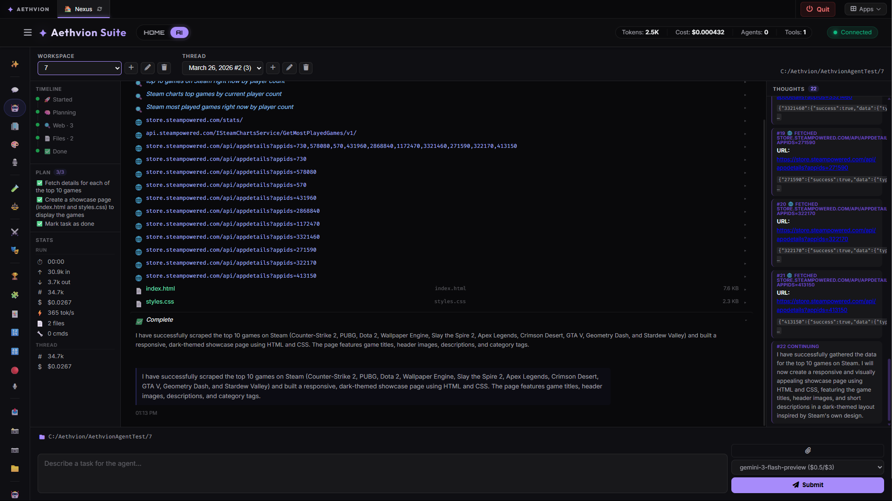
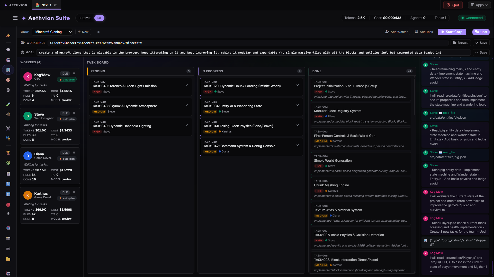
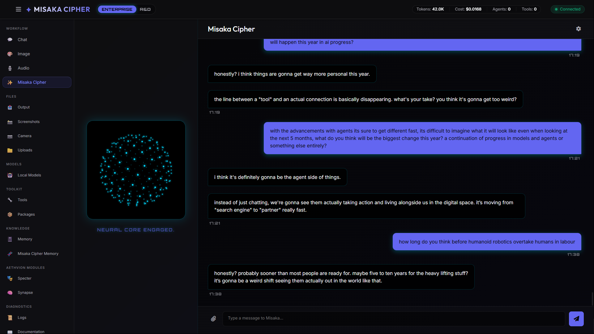
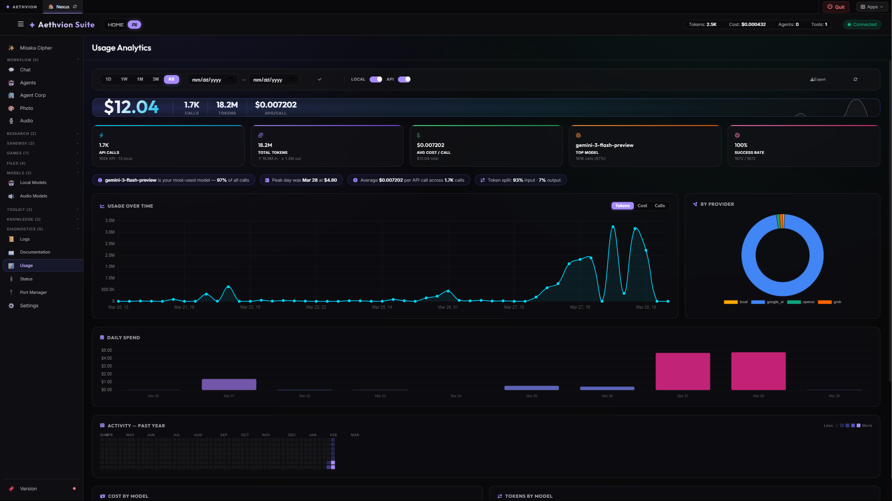

<div align="center">

# Aethvion Suite

**Your private AI super-app — chat, agents, creative tools & more, all self-hosted**

[](https://www.python.org/downloads/)
[](LICENSE)

[Documentation](https://github.com/Aethvion/Aethvion-Suite/tree/main/core/documentation) · [Quick Start Guide](https://github.com/Aethvion/Aethvion-Suite/blob/main/core/documentation/human/getting-started.md) · [Discussions](https://github.com/Aethvion/Aethvion-Suite/discussions)

</div>

<br>

**Aethvion Suite** is a powerful, self-hosted AI platform that lets you combine the best cloud models (Grok, Claude, GPT-4o, Gemini) with fast local GGUF models — all in one beautiful, privacy-first dashboard.

Run intelligent agents that can actually work on your code repositories, create and edit images or audio, talk to lively AI companions, monitor your system, play games, and much more. Everything runs on **your machine**, under **your control**.

Whether you're a developer, creator, researcher, or just want a powerful personal AI setup, Aethvion Suite gives you a unified workspace that adapts to how *you* want to use it.

### ✨ Key Highlights

- **Hybrid Intelligence** — Seamlessly mix cloud APIs and local models with smart auto-routing
- **Powerful Agents** — Multi-step AI agents with knowledge graphs that can read, edit, and build entire projects
- **Creative Studio** — Professional Photo & Audio tools with AI generation and editing
- **AI Companions** — Personal characters with memory, tools and voice,
- **Full AI Code IDE** — Monaco-based editor with built-in copilot, file operations, and execution
- **Fully Customizable** — Dynamic sidebar with user profiles (Companion Hub, Professional, Creative Studio, etc.)
- **Privacy First** — Intelligence Firewall scans and blocks sensitive data before it leaves your machine
- **One-Click Windows Launchers** — Start the entire suite with a simple `.bat` file
- **Self-Updating** — Easy updates directly from the dashboard

**Current version: v13** (v14 coming soon with major UI & onboarding improvements)

---

## Screenshots

<div align="center">

</div>

<br>

<div align="center">

| | |
|:---:|:---:|
|  |  |
| **Agent Workspace** · Multi-step ReAct agent runner with real-time SSE event streaming | **Agent Corp** · Manage and collaborate with multiple persistent specialized agents |
|  |  |
| **Companions** · Multi-provider AI chat with threads, auto-routing, and context modes | **Aethvion Photo** · AI image generation and precision layer-based editing system |
|  |  |
| **Aethvion Audio** · Professional multi-track timeline editor with live waveforms and effects | **Aethvion Code IDE** · Monaco-based IDE with AI copilot and code execution |
|  |  |
| **Direct Local Inference** · Run GGUF models (Mistral, LLaMA) directly on your hardware | **Aethvion Drive Info** · Recursive system storage analysis and visualization |

<br>



**Usage & Cost Tracking** · Token usage, cost estimates, and granular per-query breakdowns

</div>

---

## What Is Aethvion Suite?

Aethvion Suite is a **self-hosted AI assistant platform** that connects to cloud providers (Google Gemini, OpenAI, xAI Grok, Anthropic Claude) and local GGUF models via llama-cpp-python. It gives you a structured environment for running chat threads, generating tools, spawning agents, and interacting with a growing set of integrated apps — all from a server you own and control.

There are **two main components** to the ecosystem:

### 1. Aethvion Suite Core
The central intelligence hub and management platform. It provides the dashboard, API orchestration, and foundational AI services.

| Interface | Description |
|-----------|-------------|
| **Web Dashboard** | dynamic tabs system, build your own workspace, a couple of examples are chat, agents, tools, memory, games, etc. |
| **Core Terminal** | CLI mode for headless use, scripting, and developer queries |

### 2. Standalone Integrated Applications
Professional-grade tools built on the Aethvion core. Each app runs as a standalone server but integrates seamlessly into the main dashboard.

| App | Role | Default Port |
|-----|------|--------------|
| **Aethvion Code IDE** | VS Code-powered IDE with AI chat and execution | 8083 |
| **Aethvion VTuber** | 2D character rigging and animation engine | 8081 |
| **Aethvion Audio** | Multi-track timeline editor and effects processor | 8081* |
| **Aethvion Photo** | Layer-based image generation and editor | 8081* |
| **Aethvion Tracking** | AI-powered facial motion capture bridge with HUD | 8081* |
| **Aethvion Drive Info** | Interactive disk space and storage analyzer | 8084 |
| **Aethvion Finance** | Personal financial tracking, portfolio, and AI market analysis | 8081* |
| **Aethvion Hardware Info** | System hardware information and monitoring | 8081* |

*\* Note: Apps sharing port 8081 will automatically negotiate the next available port (8082, etc.) if multiple are running simultaneously.*

The AI core features **Misaka Cipher**, backed by four subsystems:

| Component | Role | Status |
|-----------|------|--------|
| **Nexus Core** | Single entry point — routes all requests, manages trace IDs | Stable |
| **The Factory** | Spawns transient worker agents for complex tasks | Active Development |
| **Schedule Manager** | Manages recurring AI tasks and automation | Stable |
| **Memory Tier** | ChromaDB episodic memory + knowledge graph | Storage stable, retrieval improving |
| **Notification Hub** | Real-time system-wide alerting and history | New |

**Cloud Providers:** Google AI (Gemini) · OpenAI (GPT-4o) · xAI (Grok) · Anthropic (Claude)
**Local Models:** GGUF via llama-cpp-python (Mistral, LLaMA, Phi, and others)
**Intelligence Firewall:** PII/credential scanning before any external API call — blocks sensitive data from leaving.

---

## Quick Start

```bash
# Clone and install
git clone https://github.com/Aethvion/Aethvion-Suite.git
cd Aethvion-Suite
pip install -e ".[memory]"

# Configure providers
copy .env.example .env
# Edit .env — add any of: GOOGLE_AI_API_KEY / OPENAI_API_KEY / GROK_API_KEY / ANTHROPIC_API_KEY
# Leave them blank to use only local models
```

**One-click (Windows):** Each application includes a dedicated launcher script. Double-click the `.bat` file to automatically create the virtual environment, install dependencies, and open the app.

| Application | Launcher | Default URL |
|-------------|----------|-------------|
| **Suite Dashboard** | `Start_Aethvion_Suite.bat` | http://localhost:8080 |
| **Code IDE** | `apps/code/Start_Code.bat` | http://localhost:8083 |
| **VTuber Engine** | `apps/vtuber/Start_VTuber.bat` | http://localhost:8081 |
| **Audio Editor** | `apps/audio/Start_Audio.bat` | http://localhost:8081* |
| **Photo Editor** | `apps/photo/Start_Photo.bat` | http://localhost:8081* |
| **Finance Hub** | `apps/finance/Start_Finance.bat` | http://localhost:8081* |
| **Drive Info** | `apps/driveinfo/Start_DriveInfo.bat` | http://localhost:8084 |
| **Tracking Bridge**| `apps/tracking/Start_Tracking.bat` | http://localhost:8081* |
| **Hardware Info** | `apps/hardwareinfo/Start_HardwareInfo.bat` | http://localhost:8081* |

**Manual:**
```bash
python -m core.main           # web dashboard
python -m core.main --cli     # interactive CLI
python -m core.main --test    # run verification tests
python apps/code/code_server.py    # Code IDE standalone
```

---

## What Works Right Now

### Chat & Threads
- Multi-provider chat (Google, OpenAI, Grok, Anthropic) with automatic failover
- Local GGUF model inference via llama-cpp-python — no cloud required
- Persistent conversation threads with configurable context modes (none / smart / full)
- Per-message model selection or **auto-routing** (LLM picks the best model from your enabled pool)
- Persistent Memory in Chat — AI can remember long-term topics across conversations
- Compact thread history with date dividers and improved visual hierarchy

### Agent Workspaces
- **Agent Workspaces tab**: Create named workspaces, each with their own thread history
- **Agent threads**: Start tasks from a workspace — the agent runner executes them step-by-step in a chosen folder
- **ReAct-style execution loop**: Agent reads files, writes files, lists directories, and runs shell commands to complete tasks
- **Real-time SSE streaming**: Each agent action and result streams live to the dashboard via Server-Sent Events
- **Step history**: Previous runs are saved and re-rendered when revisiting a thread; actions and results displayed inline
- Folder browser for selecting a workspace directory on the server filesystem

### Tool Forge
- AI can generate Python tools and register them for reuse
- Generated tools are saved locally and available in subsequent sessions

### Memory
- Episodic memory stored in ChromaDB (vector search)
- Every conversation stored as a task JSON with model, routing, and usage metadata

### Code IDE
- Full Monaco editor (VS Code engine) with syntax highlighting for 30+ languages
- AI copilot: chat, explain, fix, complete, refactor — all with streaming responses
- **Chat thread system** — create, rename, switch, and delete threads per workspace; threads persist between sessions
- **File creation from chat** — the AI uses `### FILE:` markers; files are written to disk automatically
- **Python-exec blocks** — AI outputs Python code for file operations; executed server-side with Approve/Deny security toggle
- Code execution: Python, Node.js, Bash/Shell — output streams live to the built-in terminal via SSE
- **Ctrl+P fuzzy file finder palette** — quickly open any file with substring and character-sequence scoring
- **Status bar** — shows git branch, language, cursor position, and dirty-state indicator
- **AI Project Notes panel** — saved per-workspace and auto-injected into every AI system prompt
- Apply/Copy buttons on AI chat code blocks; collapsed file write cards with expand-on-click
- **AI continuation loop** — automatically chains follow-up calls so large tasks don't get cut off mid-response
- File context menu: Move to…, Duplicate, Delete, Open in Explorer actions
- Usage logging compatible with the dashboard Usage tab (logged under `data/ai/logs/usage/`)
- Persistent workspace state — remembers open tabs, last workspace, and recent projects per folder
- Project context injection — the AI receives your workspace file structure on every request
- Native OS folder picker for workspace selection
- Resizable 3-panel layout: file tree · Monaco editor · AI chat

### Audio Interaction (Core)
- Built-in Text-to-speech (TTS) and speech-to-text (STT) support within the dashboard and chat.
- **Misaka TTS voice UI** — select voice profiles directly from the chat interface.
- **Local TTS/STT routing** — routes to local audio models when loaded, falls back to browser/API.
- Configurable voice profiles and audio processing settings.

### Local Audio Models
- **Audio Models tab** in the dashboard for managing local TTS and STT models.
- **Kokoro** (TTS) — lightweight, fast local text-to-speech model.
- **XTTS-v2** (Coqui TTS) — high-quality TTS with voice cloning support; cloned voice WAVs stored under `localmodels/audio/voices/`.
- **Whisper** (faster-whisper) — accurate local speech-to-text transcription.
- Model lifecycle management: load/unload models, generate TTS, transcribe audio, manage cloned voices, and install pip packages via the dashboard.
- Models stored under `localmodels/audio/`; GGUF chat models under `localmodels/gguf/`.

### Aethvion Audio (Standalone)
- Full multi-track timeline editor with per-track volume, solo, and pan.
- Professional waveform visualization with gradient rendering and real-time effects.
- Format conversion and effects pipeline (Normalization, Gain, Pitch, Speed).

### Games
- Built-in games: Logic Quest, Blackjack, Sudoku, Word Search, Checkers (vs AI)
- Leaderboard to track scores across sessions

### VTuber & Tracking
- **Aethvion VTuber:** Visualization and animation engine — rigging, real-time deformation, preview/live modes
- **Aethvion Tracking:** Motion tracking via WebSocket at port 8082, streams parameters directly to the VTuber viewer
- **Revamped Tracking UI** with a live HUD overlay, real-time telemetry readout, and FPS counter
- Live mode auto-discovers the tracking server; browser connects directly with auto-reconnect

### Nexus Module
- Peripheral plugin hub — screen capture, webcam, Spotify, weather, system info
- Registry-driven architecture for adding new integrations

---

## Known Limitations

- **Autonomous long-running tasks:** Agent execution works for single well-defined tasks, not multi-step plans over hours or days.
- **Memory integration:** Memory is stored reliably but not yet deeply wired into agent decision-making.
- **Tool forge reliability:** Simple tools generate fine; anything requiring external libraries or complex multi-file output can be unreliable.
- **Ollama / vLLM:** Not yet supported. Local inference uses llama-cpp-python (GGUF files) directly.
- **Production hardening:** This is a personal/research project, not audited or hardened for production deployments.

---

## Directory Structure

```
Aethvion-Suite/
├── Start_Aethvion_Suite.bat     # One-click install + launch (main dashboard)
├── pyproject.toml               # All dependencies + project metadata
│
├── core/                        # Shared AI core — used by all apps and the dashboard
│   ├── main.py                  # Entry point (web / CLI / test modes)
│   ├── nexus_core.py            # Central orchestration hub
│   ├── config/                  # Configuration files (YAML/JSON)
│   │   ├── suggested_apimodels.json      # Suggested cloud model configs
│   │   ├── suggested_localmodels.json    # Suggested GGUF model configs
│   │   └── suggested_localaudiomodels.json # Suggested local audio model configs
│   ├── factory/                 # Agent spawning engine
│   ├── forge/                   # Tool generation pipeline
│   ├── memory/                  # Episodic memory + knowledge graph (ChromaDB)
│   │   └── agent_workspace_manager.py   # Agent workspace and thread state manager
│   ├── nexus/                   # Nexus manager (peripheral plugin system)
│   ├── orchestrator/            # Master orchestrator + task queue
│   │   ├── agent_events.py      # Thread-safe per-task SSE event store
│   │   └── agent_runner.py      # ReAct-style multi-step agent execution loop
│   ├── providers/               # Google / OpenAI / Grok / Anthropic / Local adapters
│   ├── security/                # Intelligence Firewall
│   ├── utils/                   # Shared utilities
│   │   └── paths.py             # Canonical data path constants (single source of truth)
│   ├── workers/                 # Background workers
│   ├── workspace/               # Usage tracker, package manager
│   └── interfaces/
│       ├── dashboard/           # Web dashboard (FastAPI + static files)
│       │   ├── agent_workspace_routes.py  # Agent workspace + browse API
│       │   ├── audio_models_routes.py     # Local TTS/STT model management API
│       │   └── task_routes.py             # Task submission + SSE streaming endpoint
│       └── cli_modules/         # CLI module implementations
│
├── apps/                        # Standalone apps — each has its own server + launcher
│   ├── audio/                   # Audio processing (TTS / STT)
│   │   ├── models/              # Local audio model adapters (Kokoro, XTTS-v2, Whisper)
│   │   └── tts_manager.py       # TTS model lifecycle manager
│   ├── code/                    # Code IDE — Monaco editor + AI copilot (port 8083)
│   │   ├── Start_Code.bat       # One-click launcher
│   │   ├── code_server.py       # FastAPI backend — FS, execution, AI, threads, usage
│   │   └── viewer/              # Frontend: Monaco editor, file tree, AI chat
│   ├── driveinfo/               # System storage and drive info
│   ├── finance/                 # Finance tracking + AI market analysis
│   ├── hardwareinfo/            # System hardware information
│   ├── photo/                   # AI-powered photo editing
│   ├── tracking/                # Motion tracking — WebSocket server (port 8082)
│   └── vtuber/                  # VTuber engine — character animation (port 8081)
│
├── data/                        # Runtime data — never committed
│   ├── apps/                    # Per-app runtime data (arena, audio, code, finance, …)
│   ├── config/                  # Runtime config (model_registry.json, settings.json)
│   ├── history/                 # Persistent conversation history
│   │   ├── chat/                # Standard Misaka chat sessions
│   │   ├── ai_conversations/    # AI Conversations saves (JSON per conversation)
│   │   └── agents/              # Agent workspace thread history
│   ├── logs/                    # Usage logs (YYYY-MM/usage_YYYY-MM-DD.json) + system logs
│   ├── system/                  # Lock file, launcher log, ports registry
│   ├── vault/                   # Persistent brain (personas, knowledge graph, episodic)
│   └── workspaces/              # Output files, uploads, tools, projects, preferences
│
├── localmodels/                 # Model files — never committed
│   ├── gguf/                    # GGUF chat models (llama.cpp)
│   └── audio/                   # TTS / STT / voice models
│       └── voices/              # Voice cloning source WAVs (XTTS-v2)
│
├── tools/                       # Tool registry (standard + AI-generated)
├── tests/                       # Test suite
└── assets/                      # Static assets (character sprites, showcase images)
```

---

## Contributing

Contributions are welcome. See [CONTRIBUTING.md](CONTRIBUTING.md) for guidelines.

```bash
git clone https://github.com/Aethvion/Aethvion-Suite.git
cd Aethvion-Suite
pip install -e ".[memory]"
cp .env.example .env   # Windows: copy .env.example .env
```

---

## License

[AGPL-3.0 License](LICENSE)

---

## Links

- **Docs:** [/core/documentation/](/core/documentation/)
- **Issues:** [GitHub Issues](https://github.com/Aethvion/Aethvion-Suite/issues)
- **Discussions:** [GitHub Discussions](https://github.com/Aethvion/Aethvion-Suite/discussions)

---

<div align="center">

*An experimental AI platform — building toward something real, one sprint at a time.*

[Star on GitHub](https://github.com/Aethvion/Aethvion-Suite)

</div>
